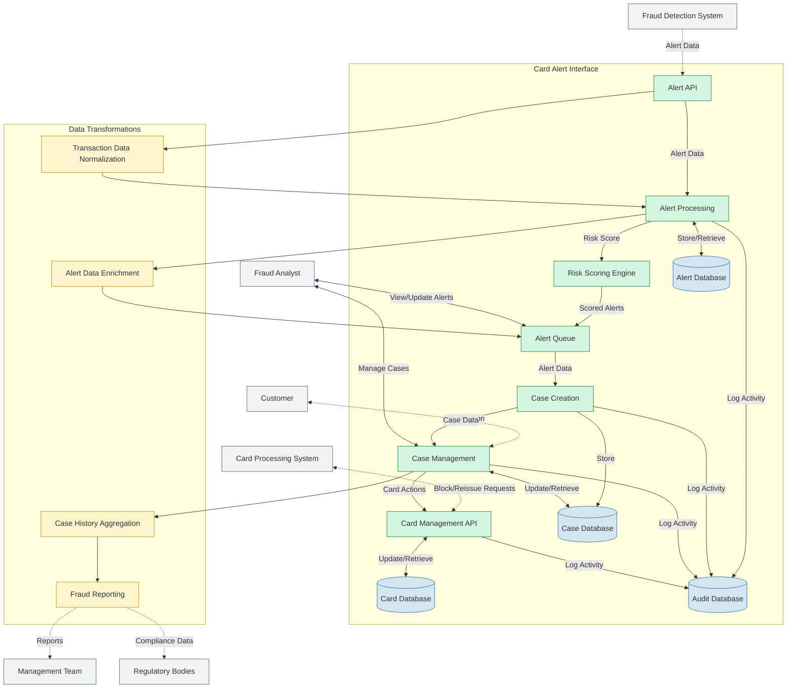

# Card Alert Interface Data Flow Diagram

This data flow diagram (DFD) shows how information moves through the Card Alert Interface system, including external entities, processes, data stores, and the flows between them.

## Purpose

The Data Flow Diagram helps to understand:
- System boundaries and external interfaces
- Major processes that transform data
- Data stores where information is persisted
- The flow of information between components

## Diagram

## System Components

### External Entities
- **Fraud Detection System**: Provides incoming alert data
- **Card Processing System**: Handles card block and reissue operations
- **Customer**: Participates in verification of suspicious activities
- **Fraud Analyst**: System users who investigate and manage cases
- **Management Team**: Receives reporting and analytics
- **Regulatory Bodies**: Receive compliance data and reports

### Major Processes
- **Alert API**: Receives and validates incoming alerts
- **Alert Processing**: Normalizes and processes alert data
- **Risk Scoring Engine**: Evaluates risk level of alerts
- **Alert Queue**: Manages alerts awaiting review
- **Case Creation**: Creates fraud investigation cases
- **Case Management**: Handles the lifecycle of fraud cases
- **Card Management API**: Manages card block and reissue operations

### Data Stores
- **Alert Database**: Stores alert information
- **Case Database**: Manages case data and history
- **Card Database**: Stores card status and actions
- **Audit Database**: Records system activity for compliance and security

### Data Transformations
- **Transaction Data Normalization**: Standardizes incoming transaction data
- **Alert Enrichment**: Adds additional context to alerts
- **Case History Aggregation**: Compiles case activity for reporting
- **Fraud Reporting**: Generates analytics and compliance reports

## Implementation Considerations

When implementing the data flows shown in this diagram:

- Ensure data consistency across different stores
- Implement proper data validation at system boundaries
- Use appropriate authentication for external interfaces
- Ensure comprehensive audit logging for all data modifications
- Consider data privacy requirements for sensitive information