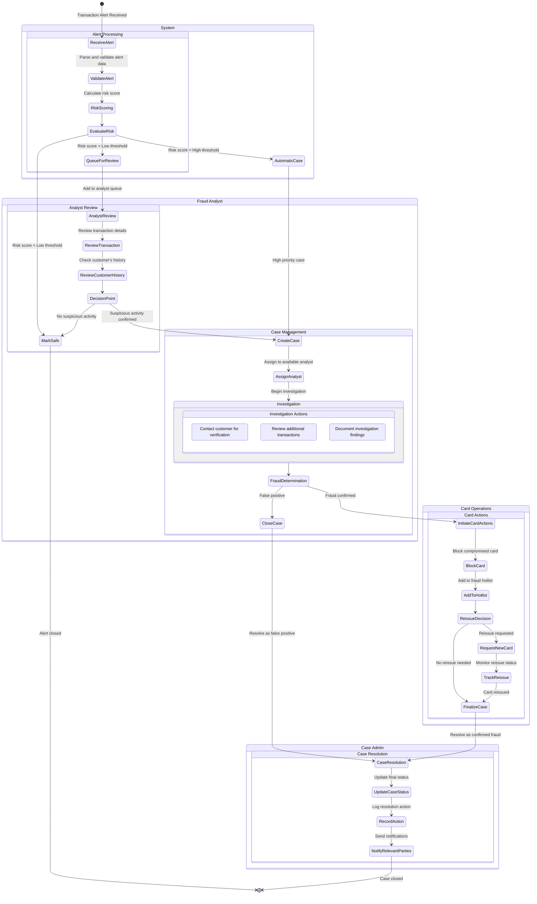

# Card Alert Interface Activity Diagram

This activity diagram shows the business processes and workflows within the Card Alert Interface system. It illustrates how activities relate to each other and the different paths that can be taken during the fraud investigation process.

## Purpose

The Activity Diagram helps to understand:
- The sequence of activities in the fraud management workflow
- Decision points and alternative paths
- Responsibility areas (shown as swimlanes)
- Start and end states of the process

## Diagram

## Activity Flow

The activity diagram shows the flow through several major phases:

1. **Alert Reception and Evaluation**: System automatically receives and scores incoming alerts

2. **Analyst Review**: For alerts that require human judgment, an analyst reviews transaction details

3. **Case Investigation**: When suspicious activity is confirmed, a formal investigation begins

4. **Fraud Determination**: Decision point where fraud is either confirmed or ruled out

5. **Card Actions**: If fraud is confirmed, the card is blocked and potentially reissued

6. **Case Resolution**: Final documentation and notification of the resolution

## Responsibility Areas (Swimlanes)

The diagram uses swimlanes to show which role or system component is responsible for each activity:

- **System**: Automated activities performed by the application
- **Fraud Analyst**: Activities requiring human investigation and judgment
- **Card Operations**: Activities related to card management
- **Case Admin**: Activities related to case resolution and documentation

## Implementation Notes

When implementing the activities in this diagram:

- Ensure smooth transitions between different responsible parties
- Implement proper notification mechanisms for handoffs
- Provide adequate UI support for each activity
- Implement proper state management to track where each case is in the workflow