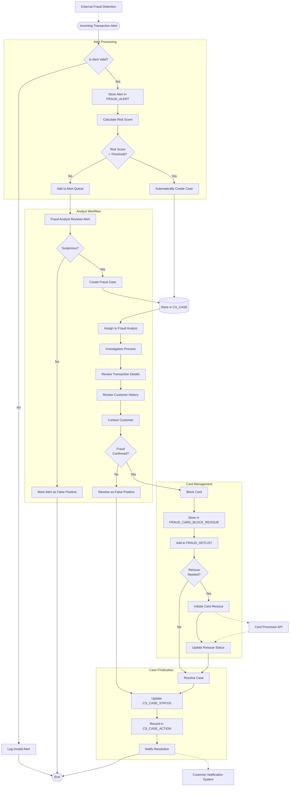

# Card Alert Interface Detailed Flow Design

This diagram illustrates the detailed flow of data and processes within the Card Alert Interface system, from the initial alert reception to the final case resolution.

## Purpose

The Flow Design diagram shows:
- The complete process flow for handling alerts and cases
- Decision points and conditional branches in the workflow
- Data storage points and system interactions
- Integration with external systems

## Diagram

## Process Stages

### 1. Alert Processing
This initial stage handles incoming transaction alerts:
- Alert validation and risk scoring
- Automatic case creation for high-risk alerts
- Queuing of lower-risk alerts for analyst review

### 2. Analyst Workflow
In this stage, fraud analysts evaluate potential fraud cases:
- Review of queued alerts
- Manual case creation for suspicious activities
- Investigation of case details and customer history
- Customer contact for verification

### 3. Card Management
When fraud is confirmed, this stage manages the compromised card:
- Card blocking
- Addition to hotlist
- Optional card reissuance

### 4. Case Finalization
The final stage handles case resolution and documentation:
- Status updates
- Action recording
- Notification to relevant parties

## Integration Points

The flow design shows integration with external systems:
- External fraud detection systems (input)
- Card processor API (for block and reissue operations)
- Customer notification systems (for resolution notifications)

## Implementation Considerations

When implementing this flow, consider:
- Proper error handling at each step
- Logging of all critical operations
- Transaction management for database operations
- Authentication and authorization controls