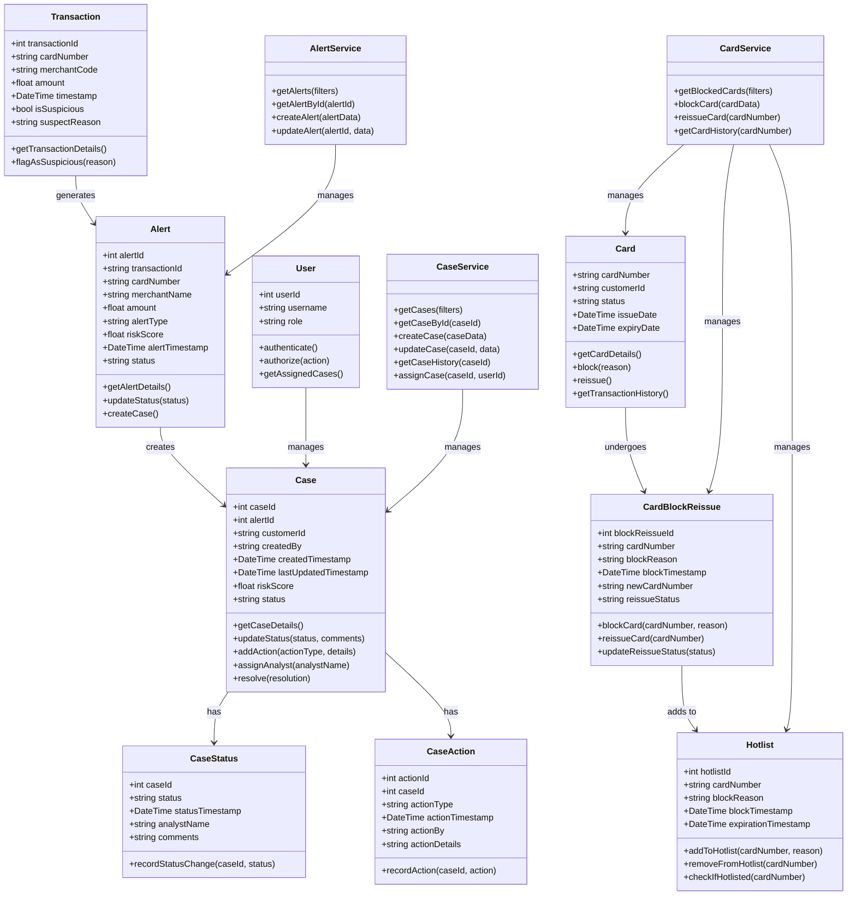

# Card Alert Interface UML Class Diagram

This diagram illustrates the core domain model and object relationships within the Card Alert Interface system. It shows the classes, their attributes, methods, and relationships between different entities.

## Purpose

The UML Class Diagram helps developers understand:
- The core entities in the system and their properties
- Relationships between different objects
- Service classes that implement business logic
- Methods available on each class

## Diagram

## Key Classes

### Core Domain Entities
- **Alert**: Represents a suspicious transaction alert detected by the system
- **Case**: Encapsulates a fraud investigation case created from one or more alerts
- **Card**: Represents a payment card that can be blocked or reissued if compromised
- **User**: Represents a system user, typically a fraud analyst

### Service Classes
These classes encapsulate the business logic for managing the core entities:
- **AlertService**: Handles alert-related operations
- **CaseService**: Manages case workflows and status transitions
- **CardService**: Provides card management functionality

## Implementation Notes

The class diagram serves as a guide for the implementation of the object model in the codebase. While the actual implementation may involve additional helper classes and infrastructure components, this diagram captures the essential domain objects and their relationships.